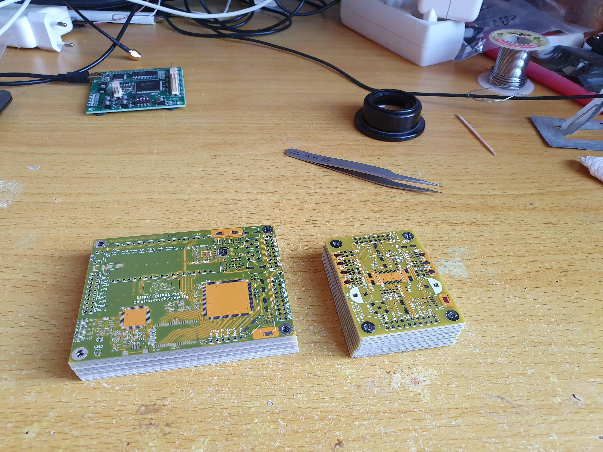

# This is an annotated account of the build&construction activities around DeWille

## 26-Nov-2019
*DeWille_Control_Rev_1_0* and *DAC_PCM1794_Rev1_0*, rev. #7dc6edd, sent to 
[SeeedStudio](https://www.seeedstudio.com/fusion_pcb.html) for fabrication. Total cost is $74.20:
* $4.90 for 10 pcs of DAC_PCM1794
* $49.90 for 10pcs of DeWille_Control
* $19.40 shipping

## 13-Dec-2019
Parts for first two prototypes ordered from [Comet](http://www.comet.bg) and [Mouser](http://www.mouser.bg)

## 17-Dec-2019
Parts arrived

## 02-Jan-2020
Control and DAC Boards arrived

## 08-Jan-2020
Started soldering one Control board.

## 09-Jan-2020
One BaseBoard sent to [Selectra](http://www.selectrapcb.com) for fabrication

## 11-Jan-2020
Control board soldering complete, with the exception of the FPGA, the Si5344 and the non-washable components (SMA 
connectors and DIP switces). Applied power and verified that all supply voltages are correct. Gave a final wash
to the Control board to clean flux residue.

## 12-Jan-2020
Soldered two DAC boards without the DAC chips. Applied power and verified supply voltages.
Soldered the rest of the components on the Control board.

## 25-Jan-2020
BaseBoard received from PCB house

## 2-Feb-2020
Soldered BaseBoard components without transformers and big filtering caps. Powered the +5V regulator from bench
supply, got +4.6V output due to error in schematic (R217/R220 divider not taken into account when calculating
reference voltage). Changed R212 to 1.5k and got +4.99V output into a 56 Ohm dummy load, verified that regulator
is stable with scope and left it for ~2 hours. With a 6.6 Ohm load(little less than 1A current) and no heat-sink,
the regulator transistor experienced a non-destructive thermal runaway (but the output voltage increased, so 
it may have potentially damaged the rest of the circuit) - probably need to reconsider the topology for later.

Because of the above, decided to use the analog supplies in capacitance multiplier mode rather than regulator, so 
removed U201, U202 and the resistors around them.

## 5-Apr-2020
Some work on the software for the Control board:
 * Settled on using the Espressif-supplied version of FreeRTOS along with [PlatformIO](https://platformio.org/) 
 as a base for the software.
 * Implemented a (mostly) platform-independent logger and routed it through the secondary UART of FT2232
 * Implemented a SPI bus arbitrator, to allow multiple components to communicate with the multiple slaves on the
 SPI bus.
 * Added Si553x-specific pseudo-driver that allow read/write of specific registers and bulk set-up based on. 
 [ClockBuilderPro](https://www.silabs.com/products/development-tools/software/clockbuilder-pro-software) exports
 * Added a small script (SiMerge.py) to automatically merge multiple CBP exports into a single file.

After some trial&error, Si5344 started outputting clock signals. Next I'm shifting to the FPGA to try and get some
actual audio data going.

## 20-Apr-2020
After spending some time in Lattice Diamond, I've decided to switch as much as possible to an open/free toolset. All
FPGA modules will be developed in simulation, using Icarus [Verilog](http://iverilog.icarus.com/) &
[GTKWave](http://gtkwave.sourceforge.net/). Only the final synthesis and verification will be done within Diamond (or
another tool if/when the FPGA is changed).
So far, a dummy (as in not doing much) SPI slave module is implemented, along with a testbench and support
infrastructure - I am able to execute the testbench and check the signals/data visually in a single command
